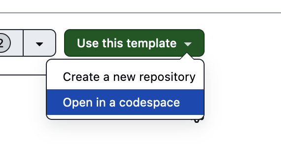
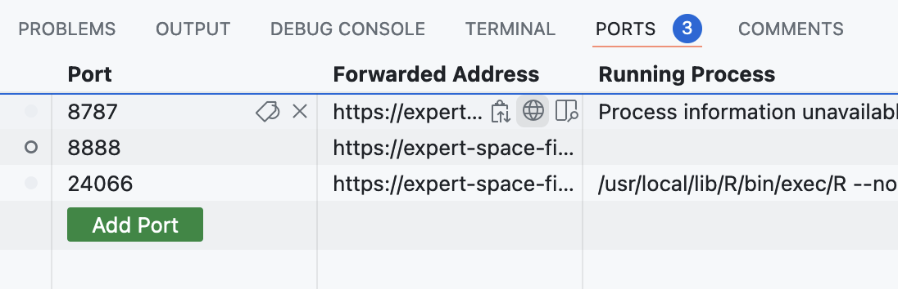
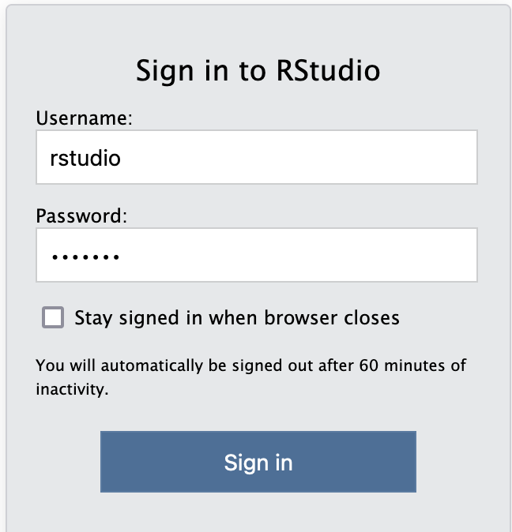

# Storyball

### A hands-on session on finding sports data

### IRE 2024 Conference

### Derek Willis, University of Maryland

### thescoop.org/storyball

## Getting Started

You need to have a GitHub account to take full advantage of what we're doing here, including being able to walk through some data analysis. You can skip that and just watch, too, but if you want try it yourself, sign into your [GitHub](https://github.com/) account (don't have one, it's free to create one).

If you've done that, go to [this repository](https://github.com/dwillis/storyball) and click on the green "Use this template" button and then choose "Open in a codespace":



It'll take some time to get things setup, but keep that tab open and we'll cover some other stuff first.

## Where to Find Raw Data

#### GitHub

GitHub and other data repositories hosts lots of public collections filled with various sports data. There are collections of data mostly scraped from other websites. For example:

-   [College Rosters](https://github.com/Sports-Roster-Data/) (WBB and Volleyball)
-   [MLS Soccer Rosters](https://utdata.github.io/mls-roster-profiles/)
-   [English Women's Football Database](https://github.com/probjects/ewf-database)
-   [Match Score Dataset for Team Ball Sports](https://data.mendeley.com/datasets/2pt4vmyf27/2)
-   [First Class Cricket Matches](https://github.com/outside-edge/fairly_random)
-   [NCAA Women's Volleyball Data](https://github.com/dwillis/NCAAWomensVolleyballData)

There's a [whole GitHub Topic](https://github.com/topics/sports-data) on this that's worth exploring.

## Where to Find Data for Use in R

### Sports Reference

The constellation of [Sports Reference sites](https://www.sports-reference.com/) cover lots of sports, and they provide interesting and useful tables that you can turn into CSV files. [Here's one way to do that](sportsref.rmd).

## Back to Your Codespace

Your codespace should be ready to go by now. In the lower part of the screen, click on the "Ports" tab and then on the global icon for port 8787 by hovering over the "Forwarded Address" value as shown:



You'll get a sign-in page: the username and password are both rstudio:



When RStudio is up and running, you can click on the storyball folder on the lower right and then on the  `index.rmd` file and follow along!

# Using packages to get data

There is a growing number of packages and repositories of sports data, largely because there's a growing number of people who want to analyze that data. But with these packages, someone has done the work of gathering the data for you. All you have to learn are the commands to get it.

One very promising collection of libraries is something called the [SportsDataverse](https://sportsdataverse.org/), which has a collection of packages covering specific sports, all of which are in various stages of development. Some are more complete than others, but they are all being actively worked on by developers. Packages of interest in this class are:

-   [cfbfastR, for college football](https://cfbfastr.sportsdataverse.org/).
-   [hoopR, for men's professional and college basketball](https://hoopr.sportsdataverse.org/).
-   [wehoop, for women's professional and college basketball](https://wehoop.sportsdataverse.org/).
-   [baseballr, for professional and college baseball](https://billpetti.github.io/baseballr/).
-   [worldfootballR, for soccer data from around the world](https://jaseziv.github.io/worldfootballR/).
-   [hockeyR, for NHL hockey data](https://hockeyr.netlify.app/)
-   [recruitR, for college sports recruiting](https://recruitr.sportsdataverse.org/)

Not part of the SportsDataverse, but in the same neighborhood, is [nflfastR](https://www.nflfastr.com/), which can provide NFL play-by-play data. There also are a growing number of Python libraries.

Because they're all under development, not all of them can be installed with just a simple `install.packages("something")`. Some require a little work, some require API keys.

The main issue for you is to read the documentation carefully. Because many of them are focused on play-by-play data, they might not work for your purposes depending on what you want to do. This is especially true of the baseballR package.

## Ok, so what about an example?

I'm glad you asked. I love women's basketball, and occasionally write about it for [Her Hoop Stats](https://herhoopstats.com/). Earlier this year I was interested in exploring whether there was a home-court officiating advantage for some teams. That analysis is [here](wbb.rmd) and my write-up is [here](https://herhoopstats.substack.com/p/for-wvu-theres-no-place-like-home).

## Using cfbfastR as a cautionary tale

cfbfastR presents us a good view into the promise and peril of libraries like this.

You can install it with `install.packages("cfbfastR")` and then [get an API key from College Football Data](https://collegefootballdata.com/key). Once your key is emailed to you, you'll need to make sure that your API key has been added to your environment.

If you don't want to do that, I've got a key here: https://go.umd.edu/ire-cfb. Put it in the quotes below.

```{r}
#| message: false
#| warning: false
library(tidyverse)
library(cfbfastR)
Sys.setenv(CFBD_API_KEY = "QzxJpsLVmi7nAJXEBRxmgIcD0CtcMsS+1IQHAc2HwwQtW1lyXICPImPKGQvmCjL3")
```

The first thing to do is [read the documentation](https://cfbfastr.sportsdataverse.org/). You'll see that you can request data for each week. For example, here's week 1 for Maryland last season:

```{r}
maryland <- cfbd_pbp_data(
 2023,
  week=1, 
  season_type = "regular",
  team = "Maryland",
  epa_wpa = TRUE,
)
```

Let's take a look at that `maryland` dataframe to see what kind of information we get. Click on it on the right. There are 370 columns! They include the basic information you'd expect like down, distance and play, but also Expected Points Added and Win Probability for each play. The library offers [several tutorials](https://cfbfastr.sportsdataverse.org/articles/index.html).

There's not an easy way to get all of a single team's games. A way to do it that's not very pretty but it works is like this. I wouldn't run this unless you want to be waiting a bit.

```{r}
#| message: false
#| warning: false
wk1 <- cfbd_pbp_data(2023, week=1, season_type = "regular", team = "Maryland", epa_wpa = TRUE)
Sys.sleep(2)
wk2 <- cfbd_pbp_data(2023, week=2, season_type = "regular", team = "Maryland", epa_wpa = TRUE)
Sys.sleep(2)
wk3 <- cfbd_pbp_data(2023, week=3, season_type = "regular", team = "Maryland", epa_wpa = TRUE)
Sys.sleep(2)
wk4 <- cfbd_pbp_data(2023, week=4, season_type = "regular", team = "Maryland", epa_wpa = TRUE)
Sys.sleep(2)
wk5 <- cfbd_pbp_data(2023, week=5, season_type = "regular", team = "Maryland", epa_wpa = TRUE)
Sys.sleep(2)
wk6 <- cfbd_pbp_data(2023, week=6, season_type = "regular", team = "Maryland", epa_wpa = TRUE)
Sys.sleep(2)
wk8 <- cfbd_pbp_data(2023, week=7, season_type = "regular", team = "Maryland", epa_wpa = TRUE)
Sys.sleep(2)
wk9 <- cfbd_pbp_data(2023, week=9, season_type = "regular", team = "Maryland", epa_wpa = TRUE)
Sys.sleep(2)
wk10 <- cfbd_pbp_data(2023, week=10, season_type = "regular", team = "Maryland", epa_wpa = TRUE)
Sys.sleep(2)
wk11 <- cfbd_pbp_data(2023, week=11, season_type = "regular", team = "Maryland", epa_wpa = TRUE)
Sys.sleep(2)
wk12 <- cfbd_pbp_data(2023, week=12, season_type = "regular", team = "Maryland", epa_wpa = TRUE)

umplays <- bind_rows(wk1, wk2, wk3, wk4, wk5, wk6, wk8, wk9, wk10, wk11, wk12)
```

The sys.sleep bits just pauses for two seconds before running the next block. Since we're requesting data from someone else's computer, we want to be kind. Week 8 was a bye week for Maryland, so if you request it, you'll get an empty request and a warning. The `bind_rows` parts puts all the dataframes into a single dataframe.

## Another example

The wehoop package is mature enough to have a version on CRAN, so you can install it the usual way with `install.packages("wehoop")`. Another helpful library to install is progressr with `install.packages("progressr")`

```{r}
library(wehoop)
```

Many of these libraries have more than play-by-play data. For example, wehoop has box scores and player data for both the WNBA and college basketball. From personal experience, WNBA data isn't hard to get, but women's college basketball is a giant pain.

So, who is Maryland's single season points champion over the last seven seasons?

```{r}
progressr::with_progress({
  wbb_player_box <- wehoop::load_wbb_player_box(2018:2024)
})
```

With progressr, you'll see a progress bar in the console, which lets you know that your command is still working, since some of these requests take minutes to complete. Player box scores is quicker -- five seasons was a matter of seconds.

If you look at the wbb_player_box data we now have, we have each player in each game over each season -- more than 300,000 records. Finding out who Maryland's top 10 single-season scoring leaders are is a matter of grouping, summing and filtering.

```{r}
#| message: false
#| warning: false
wbb_player_box |> 
  filter(team_short_display_name == "Maryland", !is.na(points)) |> 
  group_by(athlete_display_name, season) |> 
  summarise(totalPoints = sum(as.numeric(points))) |> 
  arrange(desc(totalPoints)) |>
  ungroup() |>
  top_n(10, wt=totalPoints)
  
```

Maryland relied on Diamond Miller's scoring in 2022-23 more than they have any player's in the past seven seasons.
